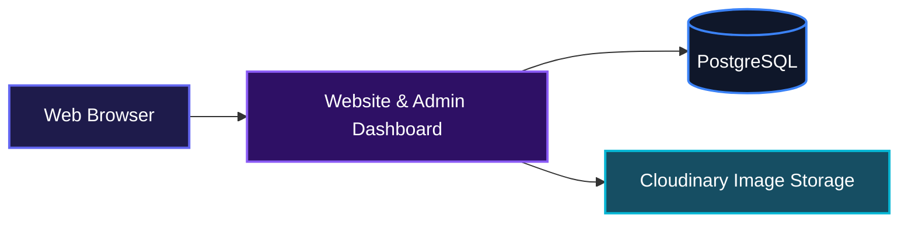
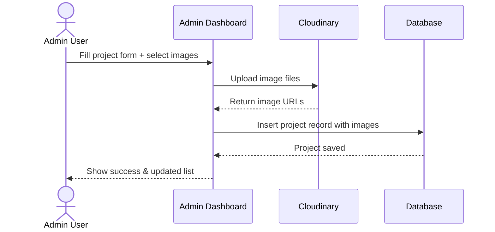
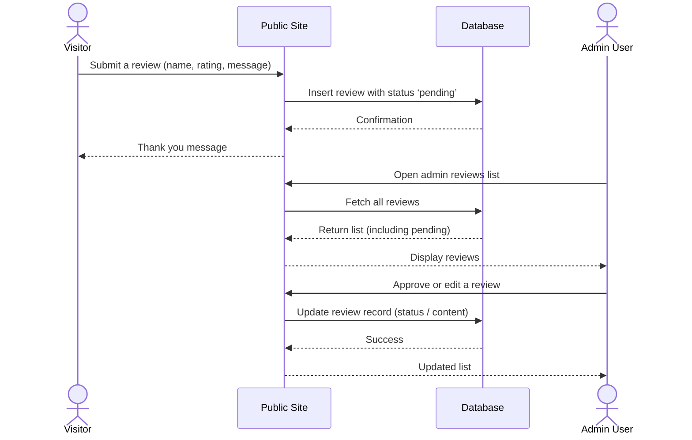
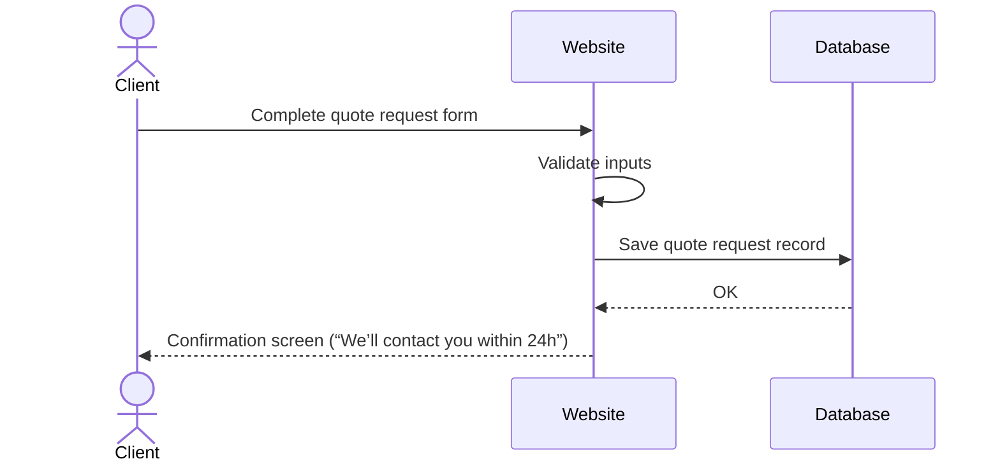

# Mega Resources LTD

A complete marketing website and admin dashboard for a borehole drilling and water solutions company in Ghana. It helps the business showcase services, project history, and client reviews, while giving the team a straightforward way to manage content, moderate reviews, and capture quote requests — all without needing to touch code.

## System Architecture



## Features

### Public website pages
- A fully responsive, animated front-end built with Next.js and Tailwind CSS. Visitors can browse services, read detailed project case studies, view a live reviews feed, and request a free site survey or custom quote.

### Admin dashboard
A dedicated admin area allows the team to manage site content without developer involvement. The three core administrative workflows are:

#### Portfolio Management
Add, edit, or delete completed projects. Each project includes a cover image (or video indicator), multiple gallery photos, location, service type, depth, yield, and a summary. Images are uploaded directly to Cloudinary before the record is saved in the database.



#### Review Moderation
Visitors submit reviews through a public form. Every submission lands in the database with a ‘pending’ status. Admins can approve, reject, or edit a review before it appears on the public reviews page.



#### Quote Request Handling
Potential clients fill out a multi-step form specifying their location, service needs, property type, and contact preferences. The submission is stored in the database and the team receives a notification. A free site survey promise is built into the flow.



### Additional highlights
- GSAP-powered scroll animations and interactive service showcase that freezes the page until the viewer scrolls through all seven services.
- A live survey depth diagram using Framer Motion to animate borehole scanning.
- Cloudinary upload widget integration for signature-based upload security.
- Drizzle ORM for type-safe database operations and migrations.
- Built-in toast notifications for form feedback and admin actions.
- Separate legal pages (Privacy Policy, Terms of Service) that can be updated as static content.

## Technologies Used

| Technology | Purpose | Link |
| --- | --- | --- |
| Next.js 16 | React framework (app router) | https://nextjs.org |
| TypeScript | Static typing | https://www.typescriptlang.org |
| React 19 | UI library | https://react.dev |
| Tailwind CSS 4 | Utility-first CSS framework | https://tailwindcss.com |
| Radix UI | Accessible headless UI primitives | https://www.radix-ui.com |
| Drizzle ORM | SQL toolkit and ORM for TypeScript | https://orm.drizzle.team |
| PostgreSQL | Relational database | https://www.postgresql.org |
| Cloudinary | Image hosting and transformation | https://cloudinary.com |
| Nodemailer | Email sending (SMTP) | https://nodemailer.com |
| Framer Motion | Animation library for React | https://www.framer.com/motion |
| GSAP | Advanced scroll-triggered animations | https://gsap.com |
| Zod | Schema validation | https://zod.dev |
| Lucide React | Icon library | https://lucide.dev |
| shadcn/ui | Components built on Radix & Tailwind | https://ui.shadcn.com |


## Local Setup

### Install dependencies

This project uses pnpm. Install the existing project dependencies with:

```bash
pnpm install
```

No extra Gmail SDK package is required for the current implementation: Google OAuth and Gmail API calls use server-side `fetch`, Node `crypto`, and the existing Drizzle/PostgreSQL stack.

### Environment variables

Copy the example file and fill in real credentials:

```bash
cp .env.example .env.local
```

Required for the admin Gmail workflow:

| Variable | Required | Purpose |
| --- | --- | --- |
| `DATABASE_URL` | Yes | Neon PostgreSQL connection string used by Drizzle for auth data, authorized users, settings, and handled metadata. |
| `AUTH_SECRET` | Yes | Secret used to derive the AES-GCM encryption key for Google OAuth tokens. Generate with `openssl rand -base64 32`. |
| `NEXT_PUBLIC_APP_URL` | Yes | Public app origin used to build the Google OAuth redirect URL. Use `http://localhost:3000` locally and your production domain in production. |
| `GOOGLE_CLIENT_ID` | Yes | Google Cloud OAuth client ID. |
| `GOOGLE_CLIENT_SECRET` | Yes | Google Cloud OAuth client secret. |
| `BETTER_AUTH_URL` | Optional | Supported as an app URL fallback for deployments that already standardize on Better Auth-style env names. |
| `BETTER_AUTH_SECRET` | Optional | Supported as an auth-secret fallback if `AUTH_SECRET` is not set. |

Existing non-admin integrations also use the Cloudinary and Brevo variables shown in `.env.example`.

### Google Cloud setup

1. Create or select a Google Cloud project.
2. Enable the Gmail API for the project.
3. Configure the OAuth consent screen for the business Google account.
4. Create an OAuth 2.0 Web application client.
5. Add this authorized redirect URI locally: `http://localhost:3000/api/auth/google/callback`.
6. Add the production redirect URI using your domain: `https://YOUR_DOMAIN/api/auth/google/callback`.
7. Put the resulting client ID and secret in `GOOGLE_CLIENT_ID` and `GOOGLE_CLIENT_SECRET`.

The app requests Gmail read/search/thread metadata plus compose/send scopes so admins can view request notifications and open Gmail compose shortcuts without storing Gmail message bodies in the application database.

### Database setup

Run migrations after setting `DATABASE_URL`:

```bash
pnpm db:migrate
```

The migration seeds `raphaelumeh21@gmail.com` as the initial `SUPER_ADMIN` in `authorized_admins`. Additional admins can be managed from `/admin/settings` after the super admin signs in.

## Author

- Portfolio: [https://umeh.site](https://umeh.site)
- LinkedIn: [https://linkedin.com/in/dubem-umeh-raphael](https://linkedin.com/in/dubem-umeh-raphael)
- X (Twitter): [https://x.com/dubem_umeh](https://x.com/dubem_umeh)

[](https://nextjs.org/)
[](https://www.typescriptlang.org/)
[](https://react.dev)
[](https://tailwindcss.com)
[](https://orm.drizzle.team)
[](https://www.postgresql.org)

[](https://dokugen.samueltuoyo.com)